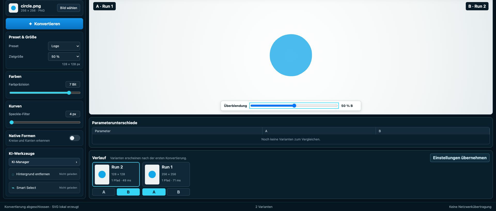
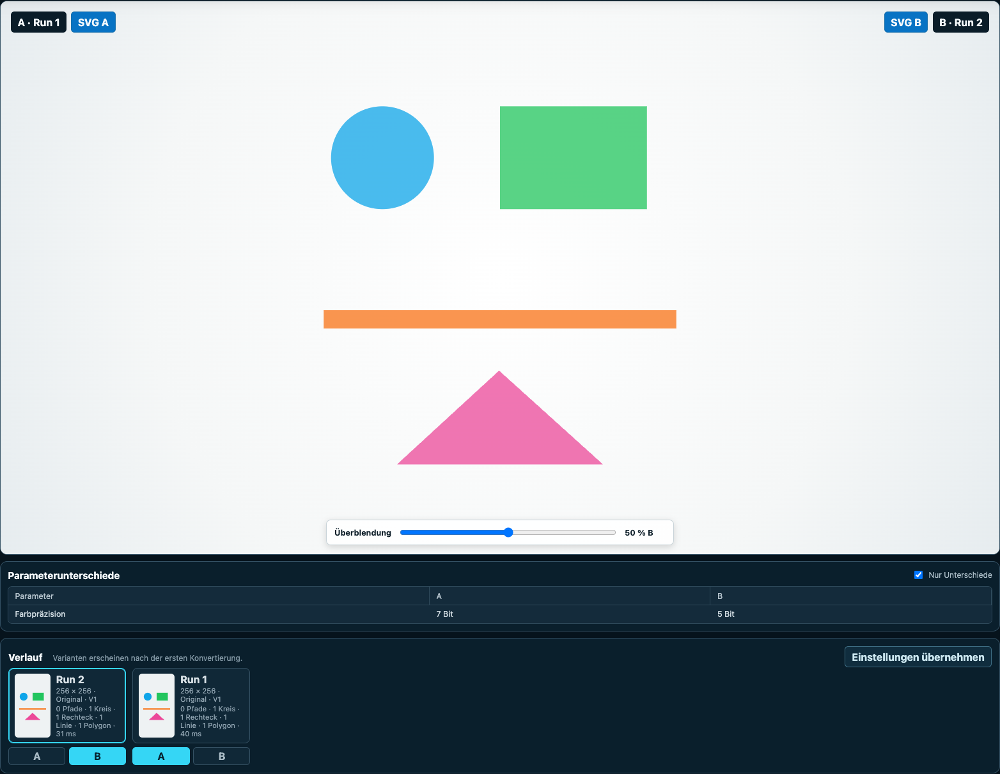

# img2svg Studio

**A local-first raster-to-SVG lab for turning visual tuning into reproducible evidence.**

[Live demo](https://studio.img2.download) · [Codemap](docs/CODEMAP.md) ·
[Architecture](docs/ARCHITECTURE.md) ·
[User guide](docs/HANDBOOK.md) · [Submission notes](docs/SUBMISSION.md) ·
[Privacy](https://studio.img2.download/datenschutz.html)



## Why it exists

Raster-to-vector conversion is usually a black box: change a slider, lose the previous result,
and guess whether the output improved. img2svg Studio makes the experiment explicit. Every
conversion becomes an immutable run, two runs can be compared as A and B, and the exact parameter
differences remain visible next to the artwork.

The complete image pipeline runs in the browser. Images are not uploaded. Optional AI models are
downloaded only after a visible user action and then run locally through WebGPU or WASM.

## What works

- Local PNG, JPEG and WebP input up to 25 MiB, including drag and drop.
- Deterministic Rust/WebAssembly vectorization with path fallback.
- Debounced live SVG preview with native clustering and contour progress; History changes only when
  a visible result is accepted.
- Optional native SVG recognition for circles, rectangles, ellipses, lines and triangles.
- Session history with immutable, individually removable runs, thumbnails, metrics and restorable
  settings.
- Layer-aligned A/B comparison, a filtered parameter-difference table and exact per-run downloads.
- A model-free Magic Wand with contiguous color selection, live sensitivity and confirmed removal.
- Local MODNet background removal with verified, abortable model downloads and WebGPU/WASM fallback.
- Local SlimSAM Smart Select with positive and negative points, refinement, inversion and apply/discard.
- Versioned manual and AI results that can be converted, compared and restored to the original image.
- Complete German and English UI with an instant, locally remembered language switch.
- Installable PWA entry points for OS sharing and desktop PNG, JPEG and WebP file opening.
- Hardware-filtered typed WebMCP tools that operate the same visible application services as the UI.
- A Streamable HTTP MCP companion with stateless Rust/WASM conversion, an SVG widget and an
  explicit local bridge to the visible Studio.
- Keyboard-operable core workflow, actionable input errors and automated accessibility/privacy audits.
- Visible dated release plus bilingual legal, privacy and license pages.
- First-party logo and fictional topography demos with reproducible browser benchmarks.



## Supported platform and judge access

The Studio targets desktop Google Chrome 150 or newer on macOS, Windows and Linux. The release
gate runs in Chrome 150 on Apple Silicon; the static build has no OS-specific server component.
The complete manual conversion workflow remains available when WebMCP or WebGPU is unavailable.
SlimSAM is offered only when the active WebGPU adapter supports `shader-f16`; MODNet can fall
back to WASM.

No account, API key or paid service is required. Judges can use the public demo without installing
the project. The command below reproduces the same static build and judge path locally.

## Try the production build locally

Requirements: Node.js 22.14 or newer and Google Chrome 150 or newer.

```bash
npm ci
npm --prefix web run test:demo
```

That command builds the static application, starts a production preview and runs the judge path in
real Google Chrome: direct navigation, image load, two accepted variants, A/B comparison, SVG export,
reload, security headers, console errors and unexpected network traffic.

For interactive use:

```bash
npm run build
npm --prefix web run preview -- --host 127.0.0.1 --port 4173
```

Open `http://127.0.0.1:4173`, switch to **English** in the header if desired, and choose **Load
logo demo** for the bundled faceted logo and its original-size Logo preset. The measured
576-pixel optimization remains selectable under **Raster size**. The small files under
`fixtures/shape-recognition/input/` remain exact engineering fixtures for individual native-shape
contracts. The **Vectorization** panel exposes all ten color-tracing parameters, shows every
default and resets them without reloading the page. **Handbook** opens contextual help; hover or
keyboard focus on a control shows its purpose, effect and default while the full guide remains
browsable below.

On the deployed HTTPS demo, Chrome can install the Studio as an app. Installed platforms expose
img2svg in **Share with…** for supported images; desktop Chrome can additionally associate PNG,
JPEG and WebP files. Both routes reuse the normal local image decoder. The service worker is only
a one-time share bridge and does not cache the application, images, SVG history or AI models.

## ChatGPT MCP companion

The separate companion accepts a ChatGPT file reference or a Base64 fixture. Before tracing,
`analyze_image` can show numbered edge-connected color regions with normalized seed coordinates;
`remove_background_region` returns the chosen region as transparent PNG for visual review and
direct reuse by `vectorize_image`. The same Rust engine then creates the SVG. The companion keeps
no image, SVG, account, or application session. `get_svg_preview` renders the returned SVG in an
MCP Apps widget and provides a byte-exact local download.

```bash
npm run build --workspace=img2svg-studio-mcp
npm start --workspace=img2svg-studio-mcp
```

The health check is `http://127.0.0.1:8787/` and the Streamable HTTP endpoint is
`http://127.0.0.1:8787/mcp`. For ChatGPT Developer Mode, connect that endpoint through Secure MCP
Tunnel or temporary HTTPS. Open the Studio, choose **Connect ChatGPT**, approve Chrome's local
network prompt, and ChatGPT can inspect the visible workspace, list or load browser-local presets,
configure conversion and accept the draft. Only JSON commands and results cross this session;
image bytes stay in the browser. The complete connection, privacy and Tauri contracts are in the
[Apps SDK companion guide](docs/APPS_SDK.md).

## Quality gate

```bash
npm run check
```

The gate checks formatting, lint, the 1,000-line source limit, TypeScript, Vitest, the production
build, Rust tests, formatting and Clippy. Browser contracts are separate so their intent stays
explicit:

```bash
npm --prefix web run test:e2e
npm --prefix web run test:demo
```

## Architecture

The UI and all WebMCP tools call the same typed controllers. Conversion moves RGBA bytes through a
Web Worker into a small WASM boundary and the Rust engine. The stateless MCP companion uses the same
WASM boundary from Node. AI model sessions stay behind a lifecycle registry that owns download
verification, cancellation, inference barriers and disposal. See the
[architecture overview](docs/ARCHITECTURE.md) for the stable boundaries and the
[codemap](docs/CODEMAP.md) for concrete change entry points. The
[TypeScript 7 decisions](docs/TYPESCRIPT_7.md) explain native-compiler settings, explicit MCP
export annotations and measured parallelization. The
[vectorization feature review](docs/VECTORIZATION_FEATURE_REVIEW.md) prioritizes measured next
steps; the [test-strategy review](docs/TEST_STRATEGY_REVIEW.md) records where tests actually found
defects and where a leaner acceptance is sufficient.

Core technology:

- TypeScript 7, Vite 8 and browser-native HTML/CSS.
- Rust 1.91 or newer, WebAssembly and `visioncortex`/VTracer tracing.
- Transformers.js with revision-pinned MODNet and SlimSAM ONNX artifacts.
- The current WebMCP imperative API through `document.modelContext`, with a full UI fallback.

## Built with Codex and GPT-5.6

This studio was built during OpenAI Build Week with Codex running GPT-5.6 Sol as the primary
engineering partner. We worked in small vertical slices: write an executable Given–When–Then
contract, watch it fail, implement the smallest coherent behavior, simplify it, test it in Chrome,
update the handbook and commit the completed slice.

Codex accelerated the work that normally fragments across disciplines: turning the approved UI
mockup into a responsive product, designing typed TypeScript/Rust boundaries, generating geometric
ground-truth fixtures, auditing dormant `visioncortex` shape algorithms, integrating two real
browser models, tracking the changing WebMCP contract, and continuously testing accessibility,
privacy and deterministic output. The decisive design choice was to expose one set of application
services to both humans and agents instead of building a second hidden automation path.

The dated commit history and the primary Codex build thread distinguish this work from the existing
`img2.download` predecessor. That predecessor is a separate product; this repository contains the
new Studio and a small drop-in WebMCP adapter prepared for the predecessor.

## Privacy and current limits

- In the browser Studio, no image, mask or generated SVG leaves the browser.
- The optional ChatGPT companion either processes one explicitly supplied temporary image or
  relays a narrow command to a visibly connected Studio. The relay transfers no image bytes.
- There is no telemetry, tracker or account requirement.
- Model files are the only intentional cross-origin requests and start only on demand.
- History is in memory and keeps every run for the current image until the user deletes it;
  reloading starts a fresh workspace.
- SlimSAM requires WebGPU with `shader-f16` and is hidden when unsupported. MODNet falls back to
  WASM when WebGPU is unavailable.
- WebMCP is progressive: unsupported browsers retain the complete manual UI.
- PWA installation, OS share targets and file associations depend on platform support; the normal
  browser tab remains the primary judge and WebMCP path.

### Jury: connect ChatGPT to the visible Studio

The bridge is included in `mcp/src/studio-relay*.ts` and `web/src/webmcp/studio-relay*.ts`. To test
it locally:

1. Run `npm ci`, `npm run build`, then `npm start --workspace=img2svg-studio-mcp`.
2. Expose `http://127.0.0.1:8787/mcp` through an HTTPS tunnel and add that `/mcp` URL as the
   **img2svg Studio** app in ChatGPT Developer Mode.
3. Open `https://studio.img2.download`, choose **Connect ChatGPT**, and allow Chrome's one-time
   local-network request. In ChatGPT use **Settings → Plugins → img2svg Studio → Refresh**; the app
   must list twelve actions.
4. Load **Logo demo**. Ask ChatGPT to preview the original's black connected background with the
   Magic Wand at `x 0.01`, `y 0.01`, sensitivity `15`, without removing it. After the turquoise
   mask appears, ask it to remove the visible selection, load **Jury Logo**, and accept the draft.

The browser performs both Magic Wand operations and conversion locally. The Companion receives
only typed parameters, status, measurements and preset names. A command fails explicitly when no
Studio tab is connected. The complete narrated rehearsal is in
[docs/release/DEMO_SCRIPT.md](docs/release/DEMO_SCRIPT.md).

## Repository map

```text
crates/         Rust vectorization engine and WASM boundary
web/            TypeScript application, browser models and WebMCP
mcp/            Stateless Node/TypeScript Streamable HTTP companion
fixtures/       Small original geometric and AI test images
integrations/   Drop-in WebMCP adapter for img2.download
docs/           Product, engineering, release and submission evidence
```

## License

img2svg Studio is source-available under the
[Business Source License 1.1](LICENSE.md). Production use is free within the Additional Use Grant;
other production use requires a commercial license. On 20 July 2030, or earlier when required by
the license, each covered version changes to Apache-2.0. The voluntary
[Symbiosis Pact](SYMBIOSIS.md) describes ways humans and agents can contribute back.

Third-party code and model licenses are documented separately in
[THIRD_PARTY.md](docs/THIRD_PARTY.md); their complete preserved notices live in
[THIRD_PARTY_LICENSES](THIRD_PARTY_LICENSES/).
