# ChatGPT Apps SDK companion

## Goal

The companion exposes img2svg Studio's deterministic conversion core to ChatGPT and can explicitly
bridge eight commands into the visible local-first browser Studio. It is a Node and TypeScript MCP
server using the official MCP SDK and Streamable HTTP. Image conversion remains stateless; relay
sessions exist only in memory while the user keeps the Studio connected.

The first conversational contract is:

```gherkin
Given a user attaches an image in ChatGPT
When the model chooses conversion parameters and calls vectorize_image
Then the existing Rust engine returns a deterministic SVG and structural statistics
When the user asks to make the result simpler
Then the model calls vectorize_image again with a lower detail level
And vectorize_image renders the new SVG with an exact download action
```

## Smallest architecture

```mermaid
flowchart LR
  ChatGPT["ChatGPT model"] --> Connection["Secure MCP Tunnel or public HTTPS"]
  Connection --> Http["Stateless Streamable HTTP"]
  Http --> Analyze["analyze_image data tool"]
  Analyze --> Remove["remove_background_region data tool"]
  Remove --> Vectorize["vectorize_image + preview widget"]
  Vectorize --> Decode["bounded raster decode"]
  Decode --> Wasm["existing img2svg WASM boundary"]
  Wasm --> Core["shared img2svg-core Rust crate"]
  Core --> Result["SVG + typed statistics"]
  Result --> Widget["MCP Apps SVG widget + download"]
```



Statistics stay in concise `structuredContent`; the exact SVG travels in result `_meta`, which is
visible to the widget but not the model. This prevents large SVG strings from consuming the model
context while keeping the widget free of conversion logic.

## Tool contracts

### `analyze_image`

The model supplies one image and a sensitivity from 0 to 100. The tool samples deterministic
points along the original image edge, flood-fills four-connected colors against each seed, sorts
the resulting regions by size and returns at most twelve candidates. Each candidate contains a
one-based region number, sampled RGBA color, pixel count, coverage and a normalized seed in the
closed range 0 to 1. The returned PNG overlays the regions and labels their seeds, so the model
does not need to estimate screen pixels or depend on widget size.

### `remove_background_region`

The model copies a seed and sensitivity from `analyze_image`. The tool maps that normalized point
back to the original raster, recomputes the connected mask and changes only selected alpha bytes
to zero. It returns a visible indexed PNG content block, Base64 PNG and removal statistics. The
256-color ceiling matches the vectorizer contract and keeps the stateless hand-off bounded. The
original remains unchanged, and the returned Base64 can be supplied to `vectorize_image` only
after the model has inspected it.

### `vectorize_image`

Inputs:

- `image`: ChatGPT file reference declared through `_meta["openai/fileParams"]`.
- `image_base64`: compatibility input for MCP Inspector and non-ChatGPT hosts.
- `background_removal`: optional normalized seed and sensitivity from the region analysis.
- `mode`: `trace` for paths or `shapes` for evidence-backed native SVG elements.
- `color_count`: requested palette size from 2 to 256; 256 selects the full 8-bit palette.
- `detail_level`: `low`, `medium`, or `high`; mapped to explicit speckle and path-precision settings.
- `scale_percent`: optional proportional SVG output size from 10 to 400; defaults to 100.

Exactly one image input is required. The server bounds downloaded and decoded image sizes before
calling the engine. ChatGPT receives effective parameters, byte size, path count, native shape
counts, source dimensions, and output dimensions. The attached widget alone receives the SVG. If
`background_removal` is present, the server removes that connected region and immediately traces
the transparent raster. This avoids sending a large intermediate PNG through the model.

The description teaches the model to start flat logos with `shapes`, four colors, and low detail;
illustrations with 16 colors and medium detail; and photographs with 64 colors and high detail. It
uses 256 colors only when the user explicitly asks for full 8-bit palette quality. A request such
as “make it simpler” lowers detail and color count on the next call.

### `get_svg_preview`

This compatibility tool accepts SVG already held by another MCP client. ChatGPT does not need it
after `vectorize_image`, because that tool now attaches the same iframe directly. The iframe renders
an image URL, reports the same statistics, and downloads the exact hidden SVG bytes.

## Hosting and privacy

The browser Studio keeps all images local and needs no MCP server for manual use or native WebMCP.
For the visible ChatGPT demo, the user chooses **Connect ChatGPT**. Chrome then permits the public
Studio to reach `http://127.0.0.1:8787/studio-relay`; the local server already exposed to ChatGPT
through `/mcp` relays only tool names, parameters and JSON results. It never relays image bytes.

The eight relayed tools are `get_workspace_state`, `list_conversion_presets`,
`save_conversion_preset`, `load_conversion_preset`, `configure_conversion` and
`convert_current_image`, plus the two-step `preview_magic_wand_selection` and
`apply_magic_wand_selection`. The first Magic Wand call shows the connected component in the
visible Studio without changing pixels; only the second call creates the transparent processed
PNG. The browser executes the same WebMCP tool objects as the native browser agent. Relay HTTP
endpoints accept only loopback Host headers, the production Studio or local-dev
Origin, and random session credentials. The most recently polling tab is active; an idle tab
expires after sixty seconds and a command after thirty seconds. Command retrieval holds one HTTP
request open instead of relying on a browser timer, so Chrome can keep the bridge alive while the
Studio tab is in the background.

After adding or changing a tool, refresh the Developer Mode installation under **Settings →
Plugins → img2svg Studio → Refresh**. ChatGPT otherwise keeps the previously discovered tool
inventory even though the MCP server already exposes the new contracts.

For Developer Mode, the preferred smallest setup keeps `http://127.0.0.1:8787/mcp` local and uses
OpenAI Secure MCP Tunnel. The tunnel requires its own `tunnel_id` and runtime API key, but it does
not expose an inbound port and does not add an OpenAI API call to conversion. A temporary public
HTTPS tunnel is an alternative. Permanent public MCP hosting is deferred until the companion must
remain available independently of the developer machine.

The `/mcp` endpoint uses Streamable HTTP without application sessions. `GET /` is a health check,
CORS is limited to the MCP methods and headers, and errors use stable public codes without input
bytes or secrets. Conversion itself needs no API credential. Tunnel credentials and a later
external 3D-provider key stay outside the repository in environment variables.

Official setup references:

- [Secure MCP Tunnel](https://developers.openai.com/api/docs/guides/secure-mcp-tunnels)
- [Connect from ChatGPT](https://developers.openai.com/apps-sdk/deploy/connect-chatgpt)
- [Public HTTPS alternative](https://developers.openai.com/apps-sdk/build/mcp-server#step-5--expose-an-https-endpoint)

## Tauri path

Tauri does not change the engine architecture. The existing Vite UI can be served inside a Tauri
webview immediately. The preferred production adapter later calls `img2svg-core` as native Rust
through a narrow Tauri command while the browser build continues through `img2svg-wasm`.

```text
Browser: UI → Web Worker → img2svg-wasm → img2svg-core
Tauri:   UI → typed Tauri adapter       → img2svg-core
ChatGPT: MCP server → Node WASM adapter → img2svg-core
```

Conversion options and results remain platform-neutral contracts. Browser-only image loading,
object URLs, WebMCP registration, and model lifecycle stay behind adapters. This preserves one
engine and permits the desktop shell to be added as an independent vertical slice.

## 3D stretch slice

After the two-tool conversational contract passes in ChatGPT Developer Mode, one additional tool
may send the image to a pinned external 3D provider, return a GLB, and render a rotatable scene in
an Apps widget. The widget may use three.js `SVGRenderer` so each displayed frame is SVG. The slice
has one provider, one conversion path, bounded polling, typed errors, and environment-only secrets.
