# ChatGPT Apps SDK companion

## Goal

The companion exposes img2svg Studio's deterministic conversion core to ChatGPT while the existing
browser Studio remains local-first. It is a stateless Node and TypeScript MCP server using the
official MCP SDK and Streamable HTTP.

The first conversational contract is:

```gherkin
Given a user attaches an image in ChatGPT
When the model chooses conversion parameters and calls vectorize_image
Then the existing Rust engine returns a deterministic SVG and structural statistics
When the user asks to make the result simpler
Then the model calls vectorize_image again with a lower detail level
And get_svg_preview renders the new SVG with an exact download action
```

## Smallest architecture

```mermaid
flowchart LR
  ChatGPT["ChatGPT model"] --> Connection["Secure MCP Tunnel or public HTTPS"]
  Connection --> Http["Stateless Streamable HTTP"]
  Http --> Vectorize["vectorize_image data tool"]
  Vectorize --> Decode["bounded raster decode"]
  Decode --> Wasm["existing img2svg WASM boundary"]
  Wasm --> Core["shared img2svg-core Rust crate"]
  Core --> Result["SVG + typed statistics"]
  Result --> Preview["get_svg_preview render tool"]
  Preview --> Widget["MCP Apps SVG widget + download"]
```



The data tool and render tool stay separate. This lets the model inspect and reuse the structured
SVG result before choosing whether to render it, and keeps the widget free of conversion logic.

## Tool contracts

### `vectorize_image`

Inputs:

- `image`: ChatGPT file reference declared through `_meta["openai/fileParams"]`.
- `image_base64`: compatibility input for MCP Inspector and non-ChatGPT hosts.
- `mode`: `trace` for paths or `shapes` for evidence-backed native SVG elements.
- `color_count`: requested palette size from 2 to 256; the adapter quantizes before tracing.
- `detail_level`: `low`, `medium`, or `high`; mapped to explicit speckle and path-precision settings.

Exactly one image input is required. The server bounds downloaded and decoded image sizes before
calling the engine. The output contains the SVG string, effective parameters, byte size, path
count, native shape counts, source dimensions, and output dimensions.

The description teaches the model to start flat logos with `shapes`, four colors, and low detail;
illustrations with 16 colors and medium detail; and photographs with 64 colors and high detail. A
request such as “make it simpler” lowers detail and color count on the next call.

### `get_svg_preview`

Input is the SVG from `vectorize_image`. The tool attaches one MCP Apps resource and returns the SVG
as structured content. The iframe displays it through an image URL, reports the same statistics,
and downloads the exact SVG bytes. Conversion remains in the data tool.

## Hosting and privacy

The browser Studio keeps all images local and needs no MCP server. The ChatGPT companion is a
separate, explicit path: ChatGPT supplies a short-lived file reference, the stateless server reads
it for one tool call, converts it in memory, returns the result, and retains neither image nor SVG.
The documentation and widget state this distinction directly.

For Developer Mode, the preferred smallest setup keeps `http://127.0.0.1:8787/mcp` local and uses
OpenAI Secure MCP Tunnel. The tunnel requires its own `tunnel_id` and runtime API key, but it does
not expose an inbound port and does not add an OpenAI API call to conversion. A temporary public
HTTPS tunnel is an alternative. Permanent public MCP hosting is deferred until the companion must
remain available independently of the developer machine.

The `/mcp` endpoint uses Streamable HTTP without application sessions. `GET /` is a health check,
CORS is limited to the MCP methods and headers, and errors use stable public codes without input
bytes or secrets. Conversion itself needs no API credential. Tunnel credentials and a later
external 3D-provider key stay outside the repository in environment variables.

Official setup references:

- [Secure MCP Tunnel](https://developers.openai.com/api/docs/guides/secure-mcp-tunnels)
- [Connect from ChatGPT](https://developers.openai.com/apps-sdk/deploy/connect-chatgpt)
- [Public HTTPS alternative](https://developers.openai.com/apps-sdk/build/mcp-server#step-5--expose-an-https-endpoint)

## Tauri path

Tauri does not change the engine architecture. The existing Vite UI can be served inside a Tauri
webview immediately. The preferred production adapter later calls `img2svg-core` as native Rust
through a narrow Tauri command while the browser build continues through `img2svg-wasm`.

```text
Browser: UI → Web Worker → img2svg-wasm → img2svg-core
Tauri:   UI → typed Tauri adapter       → img2svg-core
ChatGPT: MCP server → Node WASM adapter → img2svg-core
```

Conversion options and results remain platform-neutral contracts. Browser-only image loading,
object URLs, WebMCP registration, and model lifecycle stay behind adapters. This preserves one
engine and permits the desktop shell to be added as an independent vertical slice.

## 3D stretch slice

After the two-tool conversational contract passes in ChatGPT Developer Mode, one additional tool
may send the image to a pinned external 3D provider, return a GLB, and render a rotatable scene in
an Apps widget. The widget may use three.js `SVGRenderer` so each displayed frame is SVG. The slice
has one provider, one conversion path, bounded polling, typed errors, and environment-only secrets.
