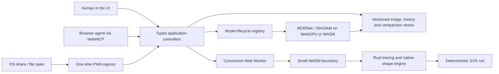

# Architecture

img2svg Studio is a static, local-first browser application. There is no application server and no
image upload path. The optional ChatGPT companion is a separate stateless process reached locally
through Secure MCP Tunnel; it does not change the browser deployment.

For concrete ownership, entry points and test routes, use the maintained
[codemap](CODEMAP.md).

## Boundaries

### Browser UI

HTML and CSS provide the visible workspace. TypeScript controllers own one user action each:
image loading, conversion, history, comparison, downloads, model lifecycle, background removal and
Smart Select. A model-free Magic Wand owns contiguous color selection. Controllers return typed
outcomes so UI buttons and WebMCP tools share validation and errors without duplicating behavior.

### Conversion engine

A Web Worker decodes the current version into RGBA and calls the generated WASM binding. The Rust
core performs color clustering and contour tracing through `visioncortex`, then optionally replaces
well-supported contours with native SVG shapes. Unrecognized or ambiguous content stays a path.
Fixtures assert geometry within tolerance and serialized output byte-for-byte where determinism is
part of the contract.

### Local AI

The model registry is the sole owner of downloading, SHA-256 and byte-size verification, caching,
backend selection, cancellation, inference barriers and disposal. MODNet generates a local alpha
matte. SlimSAM creates an image embedding once and refines a mask from positive and negative points.
Applied results become new versioned inputs; the original remains restorable.

### WebMCP

The adapter feature-detects `document.modelContext` and registers narrow imperative tools. Tool
handlers call the same controllers as visible controls and report structured success or stable
error codes. Tool availability never controls UI availability. Origin isolation and the
`Permissions-Policy: tools=(self)` response header constrain the browser capability to this origin.

### PWA ingress

The manifest advertises an image share target and desktop image file handlers. File launches and
share launches both call the existing image-loader controller. A small service worker bridges a
share POST through a random same-origin Cache Storage key and deletes the response on first read.
It deliberately does not cache the application shell, user work, SVG output or model artifacts.
Service-worker registration is progressive and cannot disable manual browser use.

## State and privacy

Image versions, SVG runs and comparisons exist only in page memory. A PWA-shared source exists in
Cache Storage only until its first page read. Object URLs are released when their versions are
replaced. Conversion has no network dependency. An explicit AI load may fetch only the
revision-pinned files declared in the model manifest; there is no analytics or telemetry.

## Deployment

Vite emits static files to `web/dist`. Cloudflare Pages serves that directory and applies the
checked-in `_headers` file. The deployment has no secret, database, function or paid runtime. The
same end-to-end contract runs against local preview and the public URL; see
[release deployment](release/DEPLOYMENT.md).
