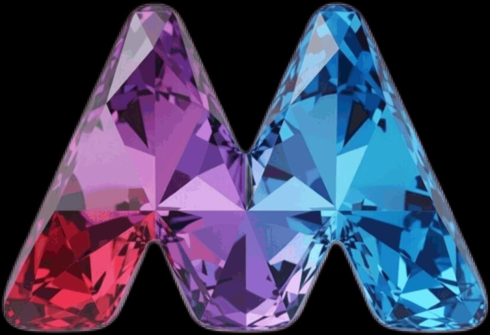

# img2svg Studio — Handbuch

## Status

Dieses Handbuch wächst zusammen mit der Anwendung. Es beschreibt nur bereits entschiedene
oder implementierte Funktionen und kennzeichnet noch nicht verfügbare Abläufe ausdrücklich.

Aktueller Stand: Die responsive Studio-Oberfläche ist lokal ausführbar. Kopfzeile,
Parameterleiste, A/B-Arbeitsfläche, Parameterunterschiede, Verlauf und Statuszeile sind sichtbar.
PNG-, JPEG- und WebP-Bilder können lokal geladen, über den Rust-/WASM-Kern in SVG umgewandelt und
mit MODNet lokal freigestellt werden.

## Produktidee

img2svg Studio ist ein lokaler Bildkonverter im Browser. Ein Rasterbild wird mit verschiedenen
Einstellungen in SVG umgewandelt. Mehrere Ergebnisse bleiben im Verlauf erhalten und können
als A und B direkt miteinander verglichen werden.

Kein Bild wird an ein Anwendungs-Backend hochgeladen. Optionale KI-Modelle werden erst auf
Anforderung in den Browser geladen.

## Oberfläche

Der verbindliche erste UI-Entwurf liegt unter
[`docs/mockups/img2svg-ui-v1.png`](mockups/img2svg-ui-v1.png).

Der in Chrome abgenommene aktuelle Stand ist hier festgehalten:
[`docs/screenshots/app-shell.png`](screenshots/app-shell.png).

Die Oberfläche besteht aus:

- einer Kopfzeile mit Ansichten und Status.
- einer linken Seitenleiste für Bild, Größe, Parameter und KI-Werkzeuge.
- einer großen Arbeitsfläche für Original, SVG und A/B-Vergleich.
- einer Parameter-Diff-Tabelle unter dem Vergleich.
- einem Verlauf mit Conversion-Runs am unteren Rand.
- einer schmalen Statuszeile mit Größe, Pfaden, Formen und Laufzeit.
- einem Fußbereich mit der sichtbaren Produktversion.

Der Fußbereich verlinkt von jeder Studio-Ansicht auf Impressum, Datenschutz und Lizenzen. Diese
Seiten sind ohne Anmeldung direkt erreichbar und verwenden dieselbe lokal gespeicherte
Deutsch-/Englisch-Auswahl wie das Studio.

### Version

Die Produktversion steht am unteren Seitenrand. `260720.01` bezeichnet die erste veröffentlichte
Revision vom 20. Juli 2026; weitere Revisionen desselben Tages erhöhen die zweistellige Endung.
Die Live-Vorschau und bewusste History-Übernahme wurden als Revision `260720.02` ausgeliefert.
Die vollständige Vektorisierungssteuerung und das interaktive Handbuch folgen mit `260720.03`.
Die fachliche Aufteilung von Engine-Optionen und Historien-Styles sowie die Codemap folgen mit
`260720.04`.
Der lokale Zauberstab mit sichtbarer Farbauswahl und Empfindlichkeit folgt mit `260720.05`.
Revision `260721.02` zeigt die automatische Vorschau sofort als ungespeicherten A/B-Entwurf
gegen das Original und trennt direkte Rasterwerkzeuge vom Tracing.
Revision `260721.03` ergänzt quell- und parameterspezifische Kontextaktionen über die rechte
Maustaste.
Revision `260721.04` zeigt beim Tracing den nativen Clusterfortschritt und die Zahl der bereits
verarbeiteten Farbflächen.
Revision `260721.05` dosiert Glätten und Schärfen unabhängig und zeigt Raster- sowie SVG-Größen
als echte Bytes, KiB oder MiB in Vorschau und Verlauf.
Revision `260721.06` verarbeitet jedes im Canvas dekodierbare Raster weiter und sucht nötige
Transparenzschlüssel deterministisch im vollständigen RGB-Farbraum.
Revision `260721.07` verwendet dieselbe sichtbare Version für Asset-Dateinamen, Service-Worker-
Updates und den kurzlebigen PWA-Share-Cache.
Revision `260721.08` ergänzt persistente Layoutmodi, echten Worker-Abbruch und eine einmalige
Hardwaremessung für die Start-Rastergröße.
Revision `260721.09` verwendet in Oberfläche und Benutzeranleitung neutrale
Vektorisierungsbegriffe, damit die Tracing-Engine austauschbar bleibt.
Revision `260721.10` härtet den stabilen nativen TypeScript-7-Build, beschleunigt den vollständigen
Typcheck und dokumentiert Compilergrenzen sowie Benchmarks für spätere Erweiterungen.
Revision `260721.11` dockt den Verlauf auf Mobilgeräten als sichtbares unteres Panel an, hält die
Layoutauswahl im Vordergrund, speichert eigene Presets und zeigt Dateiinformationen direkt am Bild.
Revision `260721.12` verhindert, dass ein vorübergehend fehlendes Worker-Asset als HTML-Fallback
zwischengespeichert wird, und prüft dessen Inhaltstyp vor jeder Veröffentlichung.
Revision `260721.13` führt die aktuelle verarbeitete Rasterversion als eigene History- und
A/B-Quelle neben Original, SVG-Entwurf und Runs.
Revision `260721.14` hält den Prüfausschnitt bei Entwurfsänderungen stabil und ergänzt exakte
Zoomeingabe, kleine Icon-Zielvorschauen sowie eine persistente Arbeitsflächenfarbe.

### Sprache

Die Sprachauswahl in der Kopfzeile schaltet die vollständige Oberfläche zwischen Deutsch und
Englisch um. Das umfasst statische Beschriftungen sowie neu entstehende Statusmeldungen,
History-Karten, A/B-Werte und Modellzustände. Die Auswahl bleibt lokal im Browser gespeichert;
Bild-, SVG- und History-Daten werden dadurch nicht persistiert. Deutsch ist die initiale
Sprache, bis „English“ gewählt wurde.

### Lokal öffnen

```bash
npm ci
npm run dev --workspace=img2svg-studio-web
```

Anschließend ist die Oberfläche unter `http://127.0.0.1:5173` erreichbar. Der aktuelle Stand
funktioniert auf breiten und schmalen Viewports ohne horizontales Seitenüberlaufen.

Vor einem Commit prüft `npm run check` im Repository-Root Formatierung, Lint, Zeilenlimit,
TypeScript, schnelle Web- und Rust-Tests, Produktionsbuild, Rust-Formatierung und Clippy.

### Engine und WASM neu bauen

Der generierte WASM-Baustein liegt versioniert unter `web/src/wasm-pkg`, sodass Start und
Web-Build nach `npm ci` ohne lokalen Rust-Build funktionieren. Änderungen unter `crates`
werden mit Rust 1.91 oder neuer, dem Ziel `wasm32-unknown-unknown` und `wasm-pack` 0.15.0 neu
gebaut:

```bash
rustup target add wasm32-unknown-unknown
npm run build:wasm
cargo test -p img2svg-core
```

Der abgenommene Build verwendet Rust 1.97.1. Auf diesem Apple-Silicon-Mac stellt die
Homebrew-Installation den Rustup-Compiler für den WASM-Build mit
`PATH="/opt/homebrew/opt/rustup/bin:$PATH" npm run build:wasm` bereit.

## Bild laden

„Bild wählen“ öffnet die lokale Dateiauswahl. Alternativ kann ein Bild auf die gestrichelte
Eingabefläche gezogen werden. Beide Wege verwenden dieselbe Decodergrenze.

„Logo-Demo laden“ öffnet ohne Dateidialog das mitgelieferte facettierte Logo des Projekteigentümers.
„Topografie-Demo laden“ öffnet eine eigens erzeugte fiktive Inselkarte mit dichten Konturlinien.
Sie enthält keine fremden Kartendaten und dient dazu, Pfadanzahl, Dateigröße und Detailverlust bei
unterschiedlicher Rastervorbereitung sichtbar zu vergleichen. Die reproduzierbaren Profile und
Messwerte stehen im [Topografie-Benchmark](release/TOPOGRAPHY_BENCHMARK.md). Das gemessene Profil
„Topografie / Konturen“ bereitet 75 % der Originalpixel mit 6-Bit-Farbpräzision, 12-Pixel-
Speckle-Filter und einer Koordinatenstelle vor; es war der beste Struktur-/Größenkompromiss und
blieb im Benchmark unter einer Sekunde Engine-Zeit.
Das Logo läuft über denselben Decoder wie eine ausgewählte Datei, behält seine 1280 × 876 Originalpixel
und aktiviert „Logo / Icon“: 6-Bit-Farbpräzision, 16 Pixel Speckle-Filter, ganzzahlige
Pfadkoordinaten und ausschließlich die konservative Polygonerkennung. Damit entstehen gemessene
542 Pfade. Der Abruf bleibt auf der App-Origin.

Die weiterhin auswählbare Rastergröße „576 px Höhe“ bereitet das Logo proportional auf 842 × 576
Pixel vor und reduziert denselben Lauf auf 315 Pfade. Methodik, Einzelachsen und Qualitätswerte
stehen in
[`docs/release/LOGO_OPTIMIZATION.md`](release/LOGO_OPTIMIZATION.md).
Für eine zweite A/B-Variante eignen sich 720 Pixel Zielhöhe und 5-Bit-Farbpräzision. Die kleinen
geometrischen Ground-Truth-Fixtures bleiben unter `fixtures/shape-recognition/input/` für exakte
Form- und Geometrietests erhalten und sind nicht der visuelle Jury-Einstieg.



Unterstützt werden PNG, JPEG und WebP bis 25 MB. Nach erfolgreichem Laden zeigt die Oberfläche
Dateiname, Format, echte Pixelmaße, eine Miniatur und die große Vorschau. Die Vorschau verwendet
eine lokale `blob:`-URL; die Bilddaten werden nicht übertragen. Jedes Bild, das der Browser in ein
Canvas dekodieren kann, wird als RGBA verarbeitet. Vollständig deckende Bilder benötigen keinen
Transparenzschlüssel; bei Bildern mit transparenten Pixeln wählt der Core deterministisch eine im
sichtbaren Bild unbenutzte RGB-Farbe aus dem gesamten Farbraum.

## Installieren, teilen und mit img2svg öffnen

Auf der ausgelieferten HTTPS-Demo kann Chrome das Studio über das Installationssymbol in der
Adressleiste als eigenständige App installieren. Die Installation ist optional; im normalen Tab
bleiben alle Funktionen einschließlich WebMCP verfügbar.

Nach der Installation kann ein unterstütztes PNG-, JPEG- oder WebP-Bild über den
Systembefehl „Teilen mit …“ an **img2svg** übergeben werden. Desktop Chrome kann dieselben
Dateitypen zusätzlich über „Öffnen mit img2svg“ starten. Welche Einträge das Betriebssystem
anzeigt, hängt von dessen PWA-Unterstützung ab. Beide Wege verwenden den normalen Bild-Loader mit
denselben Format-, Größen- und Fehlergrenzen wie „Bild wählen“.

Bei „Teilen mit …“ legt der Service Worker das Bild unter einem zufälligen Token kurz in einem
eigenen Cache ab, navigiert das Studio zu diesem Token und löscht den Cache-Eintrag beim ersten
Lesen. Er besitzt keinen App-Shell-, History-, SVG- oder Modellcache. Das Bild bleibt damit lokal
und wird nicht an einen Anwendungsserver gesendet.

Jede veröffentlichte Produktversion erhält eigene JavaScript-, CSS-, WASM- und gebündelte
Bildadressen. Der Browser kann diese Dateien dauerhaft wiederverwenden, ohne eine neue Revision zu
übersehen. HTML, Manifest und Service Worker werden bei jedem Aufruf revalidiert; die neue Seite
verweist dadurch automatisch ausschließlich auf Assets ihrer sichtbaren Versionsnummer.

Das Candy-App-Icon wurde bewusst mit dem Produkt selbst erstellt: Das Raster-Original liegt unter
[`docs/assets/app-icon-candy-source.png`](assets/app-icon-candy-source.png). Der img2svg-WASM-Kern
hat es nach lokaler Vorbereitung auf 512 × 512 Pixel mit 32 Farben und mittlerem Detail in
[`web/public/icons/app-icon.svg`](../web/public/icons/app-icon.svg) vektorisiert; daraus werden die
installierbaren 192- und 512-Pixel-Icons gerendert. Damit ist das Icon zugleich ein realer
Dogfooding-Nachweis für den Konvertierungspfad.

Beschädigte Dateien, andere Formate und Dateien über 25 MB zeigen einen verständlichen Fehler.
Eine bereits geladene gültige Vorschau bleibt dabei erhalten. Beim Laden eines neuen gültigen
Bildes wird die vorherige Objekt-URL freigegeben.

Die Kernbedienung ist mit der Tastatur möglich: `Tab` bewegt den sichtbaren Fokus, Leertaste
oder Eingabetaste löst die fokussierte Aktion aus, und Pfeiltasten ändern native Regler. Nach
einem Eingabefehler bleibt der zuletzt gültige Workspace bedienbar; eine gültige PNG-, JPEG-
oder WebP-Datei kann unmittelbar erneut gewählt werden.

## Live-Vorschau und Übernahme

### Layout anpassen

„Layout“ in der Kopfzeile konfiguriert Header, Seitenleiste und Verlauf unabhängig. „Standard“
behält die bisherige Position. „Angedockt“ hält den Bereich beim Arbeiten sichtbar; der Verlauf
wird dabei auf breiten Bildschirmen zur rechten Spalte und auf Mobilgeräten zu einem permanent
sichtbaren unteren Panel. „Eingeklappt“ reduziert den Bereich auf seine schmale Orientierung
beziehungsweise Überschrift. Die Auswahl wird lokal gespeichert und beim nächsten Start
wiederhergestellt. Auch bei eingeklapptem Header und über angedockten Panels bleibt „Layout“ im
Vordergrund erreichbar.

Beim allerersten Start misst das Studio einmalig eine kurze rasterähnliche CPU-/Speicheroperation
und berücksichtigt logische Kerne sowie den vom Browser gemeldeten Gerätespeicher. Daraus folgt
eine Start-Rastergröße von Original, 75, 50 oder 25 Prozent. Das Ergebnis wird dauerhaft lokal
gespeichert und nicht bei jedem Release neu gemessen. Die Rastergröße bleibt danach normal
auswählbar; „Auf Standard zurücksetzen“ führt weiterhin zum kanonischen Originalwert zurück.

Nach dem Laden erzeugt das Studio automatisch eine SVG-Vorschau. Jede Änderung an Rastergröße,
Filtern, Preset, Tracing-Werten, Skalierung oder Formerkennung aktualisiert dieselbe Vorschau nach
einer kurzen Entprellung. Schnelle Reglerbewegungen erzeugen dadurch keinen Verlaufsmüll;
veraltete Berechnungen dürfen ein neueres Ergebnis nicht überschreiben.

Sobald die Vorschau fertig ist, öffnet sich der deckungsgleiche A/B-Vergleich automatisch:
Das unveränderte Original steht auf A und die aktuelle, ungespeicherte SVG-Vorschau als
„Entwurf“ auf B. Der Entwurf besitzt eine eigene History-Karte, zählt aber nicht als Variante.
Jede Parameteränderung ersetzt denselben Entwurf. „Variante übernehmen“ ersetzt die Entwurfskarte
durch einen unveränderlichen Run und lässt ihn auf B gegen das Original stehen.

Unter der Arbeitsfläche zeigt „SVG“ beziehungsweise „Raster“ die aktuelle Dateigröße unmittelbar.
Aufklappen ergänzt Abmessungen, Pfad- und Formanzahl, Rechenzeit sowie die verwendete Quelle.

„Icon-Vorschau“ zeigt dasselbe aktuelle SVG wahlweise in einer 64, 128, 256 oder 512 Pixel großen
quadratischen Zielbox. Diese Größe verändert weder SVG noch Vektorisierungsparameter; sie dient der
Beurteilung eines Logos in seiner tatsächlichen späteren Anzeigegröße. Im selben aufklappbaren
Bereich gilt Weiß, Schwarz oder eine frei gewählte Farbe für Arbeitsfläche und Icon-Vorschau. Die
Ansichtsfarbe wird lokal gespeichert und verändert keine Raster- oder SVG-Daten.

Der Browser skaliert und filtert die Rasterpixel gemäß „Raster vor Tracing“ und übergibt erst
dieses RGBA-Ergebnis an einen Web Worker. Dort erzeugt der Rust-Core über die schmale WASM-Grenze
ein SVG, während die Oberfläche bedienbar bleibt. „Variante übernehmen“ speichert erst das
sichtbar geprüfte Ergebnis als unveränderlichen Run im Verlauf. Nach der Übernahme bleibt der
Button deaktiviert, bis Bild oder Parameter wieder eine neue Vorschau erzeugen.

Der erste Lauf verwendet die einmalig empfohlene Rastergröße, den Farbmodus und deterministische
`visioncortex`-Standardeinstellungen. Gleiche vorbereitete RGBA-Pixel erzeugen byteidentisches
SVG. Die Ausgabe besitzt eine passende `viewBox`, und vollständig transparente Bildbereiche
erzeugen kein Hintergrundelement.

### SVG herunterladen

Nach einer erfolgreichen Vorschau erscheint oben rechts in „A · Variante“ die Aktion
„SVG herunterladen“. Sie serialisiert genau das aktuell dargestellte SVG und speichert es mit
dem Namen des Rasterbildes und der Endung `.svg`, beispielsweise `circle.svg`.

Ein späterer Vorschaufehler zeigt seine verständliche Meldung direkt beim Eingabebild. Das letzte
erfolgreiche SVG und dessen Download bleiben verfügbar; nach einer weiteren Parameteränderung
wird die Vorschau erneut berechnet.

## Grundablauf

1. Bild per Drag-and-drop oder Dateiauswahl laden.
2. Das automatisch erzeugte SVG prüfen.
3. Rastervorbereitung, SVG-Skalierung und Tracing-Parameter variieren und die Änderungen direkt
   vergleichen.
4. Ein überzeugendes Ergebnis mit „Variante übernehmen“ in den Verlauf schreiben.
5. Ergebnis als SVG herunterladen und weitere Varianten übernehmen.
6. Das Original und einen Run oder zwei Runs im Verlauf als A und B auswählen.
7. Darstellung und Parameterunterschiede vergleichen.

Dieser Ablauf wird mit jedem vertikalen Slice ergänzt und erst dann als verfügbar bezeichnet,
wenn er im Browser getestet wurde.

## Tracing-Fortschritt

Während der lokalen Konvertierung erscheint oben in der Arbeitsfläche ein Fortschrittsfeld.
„Farbflächen erkennen“ und bei Ausschnitten „Ausschnitte aufbereiten“ zeigen den nativen
Visioncortex-Fortschritt. „SVG-Konturen erzeugen“ nennt verarbeitete und gesamte Farbflächen. Die
Phasen haben bewusst keinen erfundenen gemeinsamen Prozentwert. Nach fertiger Vorschau oder einem
Fehler verschwindet das Feld; die Statuszeile zeigt anschließend wieder das Ergebnis. „Abbrechen“
beendet auch den zugehörigen Worker, statt nur die Anzeige zu schließen. „Vorschau neu starten“
erzeugt anschließend wieder einen normalen Entwurf. Eine neue Parameteränderung beendet einen
veralteten laufenden Worker automatisch und startet nur die aktuelle Revision.
Die KI verwendet über WebMCP mit `cancel_conversion` denselben Abbruchpfad wie der sichtbare Button.

## Kontextaktionen

Ein Rechtsklick auf die Arbeitsfläche öffnet ein Menü für die tatsächlich darunterliegende
Quelle. Im A/B-Vergleich bestimmt die Trennerposition, ob A oder B gemeint ist. Das Original kann
direkt geöffnet werden; ein Entwurf bietet SVG-Ansicht, Download und Übernahme, ein gespeicherter
Run seinen Download. In „Original“ und „Verarbeitet“ zeigt derselbe Rechtsklick Zauberstab,
Hintergrundentfernung und – bei verfügbarer Browserunterstützung – Smart Select. Noch nicht
einsatzbereite Werkzeuge bleiben sichtbar deaktiviert.

Ein Rechtsklick auf einen einzelnen Parameter bietet „Im Handbuch erklären“ und „Auf Standard
zurücksetzen“. Der Handbuchbefehl öffnet sofort das passende Thema. Der Reset ändert ausschließlich
diesen Wert und aktualisiert den Live-Entwurf; beim Sammelparameter „Preset“ bedeutet der
Standardwert das vollständige Profil „Ausgewogen“. Hauptschalter und einzelne Typen der nativen
Formerkennung lassen sich ebenso unabhängig auf ihre Standards zurücksetzen. Escape, ein Klick außerhalb oder eine
ausgeführte Aktion schließen das Menü. Pfeiltasten bewegen den Fokus zwischen verfügbaren Aktionen.

Die Kopfzeile schaltet die gemeinsame Arbeitsfläche gezielt zwischen SVG, der aktuellen
verarbeiteten Rasterversion, dem unveränderten Original und dem A/B-Vergleich um. Während der
kurzen Berechnung ist „Verarbeitet“ sichtbar; die fertige Live-Vorschau öffnet automatisch den
Vergleich mit Original A und Entwurf B.

## Verlauf und A/B-Vergleich

Das geladene Rasteroriginal steht als unveränderlicher erster Eintrag im Verlauf. Nach einer
lokalen oder KI-gestützten Rasterbearbeitung steht „Verarbeitet“ als zweite versionierte Karte
daneben. Beide Raster können angezeigt und wie jeder Run als A oder B gewählt werden. Die
ungespeicherte SVG-Vorschau steht als „Entwurf“ direkt dahinter. Jede bewusste Übernahme erzeugt
genau einen unveränderlichen Run; weitere
Vorschauänderungen ersetzen wieder nur die eine Entwurfskarte. Der Verlauf hält alle Runs von neu
nach alt als horizontal bedienbare Karten. Jede Run-Karte enthält:

- die fortlaufende Run-ID.
- eine echte SVG-Miniatur.
- Zielmaße, Pfadanzahl und gemessene Laufzeit.

Das Auswählen einer Karte zeigt ihr gespeichertes SVG wieder in „A · Variante“. Die aktuell
eingestellten Regler bleiben dabei unverändert. „Einstellungen übernehmen“ kopiert anschließend
dessen validierte Raster-, Tracing- und SVG-Parameter in die Eingabemaske und berechnet beide
Maßanzeigen neu. Das geladene Originalbild, der ausgewählte Run und sein angezeigtes SVG bleiben
dabei unverändert. Die wiederhergestellten Einstellungen erzeugen automatisch eine Vorschau; eine
bewusste Übernahme erzeugt den neuen Run. Bei gleichem Bild und gleichen Einstellungen ist dessen
SVG byteidentisch zum Ausgangs-Run. „Löschen“ entfernt einen
nicht mehr benötigten Run und dessen SVG aus der Session. War der Run ausgewählt, zeigt die
Arbeitsfläche anschließend das Original; gehörte er zum A/B-Vergleich, wird der Vergleich geleert.
Beim Laden eines anderen Originalbildes beginnt eine neue leere Session-History.

Unter jeder History-Karte setzen die tastaturbedienbaren Aktionen „A“ und „B“ Original,
Verarbeitet, Entwurf oder Run in den jeweiligen Vergleichsplatz. Dieselbe Quelle belegt nie beide
Plätze. Sobald A und B gesetzt sind, zeigt die gemeinsame Arbeitsfläche zwei Raster, Raster und SVG
oder zwei SVGs deckungsgleich. Die Labels nennen die jeweilige Quelle.

Der cyanfarbene Trenner teilt dieselbe Bildfläche ohne Überblendung: links liegt A, rechts B. Er
lässt sich direkt ziehen oder über den Regler „Trennposition“ bewegen. Bei 50 Prozent zeigt die
linke Hälfte A und die rechte Hälfte B; 0 Prozent zeigt nur B, 100 Prozent nur A.

Beide Ebenen verwenden eine gemeinsame normalisierte ViewBox und erhalten darin die native
ViewBox des Runs seitenverhältnistreu. Deshalb bleiben auch unterschiedlich skalierte Runs
zentriert und deckungsgleich, ohne Kreisformen zu verzerren. Die aktuellen Eingabeeinstellungen
werden durch A/B-Zuweisungen nicht verändert.

Die Zoomtasten verändern den gemeinsamen Ausschnitt von 25 bis 800 Prozent. Mausrad oder
Trackpad zoomen um die Zeigerposition; Drag verschiebt den Ausschnitt. Auf Touch-Geräten steuern
zwei Finger Zoom und Position als Pinch-Geste. Beide Ebenen erhalten immer exakt dieselbe
Transformation. Pfeiltasten verschieben den fokussierten Vergleich tastaturbedienbar, ein
Doppelklick setzt Zoom und Position auf 100 Prozent zurück. Die Prozentanzeige in der Kopfzeile
nimmt nach einem Klick auch einen exakten Wert per Eingabetaste an. Ihr Kontextmenü setzt Zoom und
Position unmittelbar auf 100 Prozent zurück. Aktualisiert eine Parameteränderung nur den
ungespeicherten Entwurf, bleiben Zoom, Position und Trenner erhalten; erst eine tatsächlich andere
manuell gewählte A/B-Quellenkombination startet wieder zentriert bei 100 Prozent.

Die Tabelle „Parameterunterschiede“ verwendet dasselbe kanonische Schema wie die Eingabewerte.
„Nur Unterschiede“ ist standardmäßig aktiv und zeigt ausschließlich Parameter mit verschiedenen
Werten in A und B. Ohne den Filter erscheinen Rastergröße, Rasterfilter, Glättungs- und
Schärfungsstärke, Schwellwert,
alle zehn Vektorisierungsparameter und SVG-Skalierung in stabiler Reihenfolge, gefolgt vom globalen
Formerkennungsschalter und den fünf Formtypen. Beim Vergleich mit dem Rasteroriginal zeigt die
Tabelle „Quelle“ und kennzeichnet dort nicht vorhandene Konvertierungsparameter mit „—“.

„SVG A“ und „SVG B“ laden jeweils den unveränderten SVG-Text des zugeordneten Runs herunter. Die
normalisierte Vergleichsdarstellung gelangt nicht in den Export. Dateinamen enthalten Platz und
Run-ID, beispielsweise `circle-a-run-1.svg`, damit beide Ergebnisse unterscheidbar bleiben.
Die Quellkarte zeigt die komprimierte Größe der geladenen Rasterdatei. Entwurf und Runs zeigen die
exakte UTF-8-Größe ihres SVG in B, KiB oder MiB; damit ist eine Parameteränderung sofort messbar.

## Parameter

### Raster vor Tracing

„Rastergröße“ verändert die Pixel, die die Tracing-Engine tatsächlich erhält. Verfügbar sind
Originalgröße, 25, 50, 75, 125, 150, 200 und 400 Prozent sowie feste Zielhöhen von 576, 720, 1080 und 2160 Pixeln.
Die Breite wird immer aus dem Seitenverhältnis berechnet. So wird 1920×1080 bei 2160 Pixeln Höhe
zu 3840×2160, während Hoch- und Sonderformate weder beschnitten noch verzerrt werden.

„Farbe“ übernimmt RGB unverändert. „Graustufen“ berechnet eine feste Luminanz pro Pixel.
„Schwarzweiß“ wendet anschließend den einstellbaren Schwellwert von 0 bis 255 an. Der Alphakanal
bleibt in allen Modi erhalten. Die Anzeige „Vorbereitete Rastermaße“ nennt die Pixelgröße vor
der Vektorisierung; „Zielmaße“ berücksichtigt danach zusätzlich die SVG-Skalierung.

„Glätten“ und „Schärfen“ sind unabhängige Stärken von 0 bis 100 Prozent. Null schaltet den jeweiligen
Schritt aus. Die Rasterpipeline skaliert zuerst, mischt dann dosiert einen kleinen 3×3-Gaußfilter
gegen JPEG-Störungen ein und wendet danach die dosierte Unscharfmaske auf das geglättete Ergebnis
an. So kann Rauschen reduziert werden, ohne Hauptkanten ungefiltert weich zu lassen. Der Farbfilter
folgt anschließend. Eine BMP-Zwischenkopie ist nicht nötig, weil die Engine rohe RGBA-Pixel erhält.

Rastergröße, Filter und Schwellwert werden unveränderlich im Run gespeichert, über
„Einstellungen übernehmen“ wiederhergestellt und im A/B-Parametervergleich angezeigt.

### Tracing und SVG-Ausgabe

Das Preset fasst ausschließlich vorhandene, sichtbare Parameter zusammen. „Ausgewogen“ ist der
Default, „Logo / Icon“ reduziert Farben und Koordinaten, „Illustration“ entfernt kleinere Flächen
und rundet Koordinaten, „Foto / detailreich“ erhält mehr Farbinformation und glättet das
Eingaberaster, „Schwarzweiß /
Laser“ erzeugt eine binäre Vorlage. Eine manuelle Abweichung wird sichtbar als
„Benutzerdefiniert“ markiert. Ein eigener Name speichert alle sichtbaren Einstellungen lokal im
Browser; das Preset kann danach aus derselben Liste geladen oder gelöscht werden. Mit
`list_conversion_presets`, `save_conversion_preset` und `load_conversion_preset` verwendet
WebMCP exakt denselben Preset-Speicher. Alle mitgelieferten Presets starten mit
Original-Rastergröße und 100 Prozent SVG-Skalierung.

Die numerischen Parameter wirken von der Seitenleiste über den Worker und WASM bis in den
Rust-Core:

Der Farbmodus liegt bewusst im Abschnitt „Raster vor Tracing“: „Farbe“ verwendet den
farbigen Tracing-Pfad, „Schwarzweiß“ erzeugt vor demselben deterministischen Kern eine binäre
Pixelvorlage mit sichtbarem Schwellwert. Der Vektorisierungsbereich enthält die übrigen zehn
wirksamen Werte. Seine angezeigten Standards entsprechen der aktuellen Engine; deshalb beträgt die native
Farbpräzision 6 Bit.

| Parameter           |       Gültiger Bereich |  Standard | Wirkung                                                                |
| ------------------- | ---------------------: | --------: | ---------------------------------------------------------------------- |
| Farbpräzision       |                1–8 Bit |     6 Bit | bestimmt, wie nah beieinanderliegende Farben gruppiert werden          |
| Speckle-Filter      |              0–1000 px |      4 px | entfernt kleine Farbcluster                                            |
| Pfadpräzision       |            0–4 Stellen | 2 Stellen | rundet Pfadkoordinaten und senkt Bytes, nicht die Pfadzahl             |
| Überlagerung        | Gestapelt, Ausschnitte | Gestapelt | erzeugt überlagerte oder aneinanderliegende Farbflächen                |
| Kurvenmodus         | Pixel, Polygon, Spline |    Spline | erhält Pixelkonturen, vereinfacht zu Polygonen oder glättet als Spline |
| Verlaufsschritt     |                  0–255 |        16 | bestimmt den Farbabstand zwischen Verlaufsebenen                       |
| Eckenwinkel         |                 0–180° |       60° | erkennt im Spline-Modus Richtungswechsel als Ecken                     |
| Segmentlänge        |              3,5–10 px |      4 px | begrenzt die Segmentlänge der iterativen Glättung                      |
| Glättungsdurchläufe |                   1–20 |        10 | begrenzt die weitere Segmentunterteilung                               |
| Verbindungswinkel   |                 0–180° |       45° | trennt Spline-Abschnitte anhand ihrer Winkeländerung                   |
| SVG-Skalierung      |               10–400 % |     100 % | skaliert SVG und ViewBox nach dem Tracing proportional                 |

Die Oberfläche bietet für die Zielgröße 25, 50, 75, 100, 150, 200 und 400 Prozent direkt an.
Nach dem Laden eines Bildes zeigt sie die daraus entstehenden Zielmaße sofort an. Ein Lauf mit
50 Prozent aus einem 256×256-Bild erzeugt beispielsweise ein SVG mit 128×128-ViewBox.

„Standardwerte“ setzt ausschließlich die zehn Vektorisierungswerte zurück; Rastervorbereitung,
SVG-Skalierung und Formerkennung bleiben erhalten. Jeder sichtbare Wert nennt seinen Standard.
Eckenwinkel, Segmentlänge, Glättungsdurchläufe und Verbindungswinkel sind außerhalb des
Spline-Modus deaktiviert, weil sie dort keine Wirkung besitzen. Ungültige Werte werden als
typisierter Einstellungsfehler abgelehnt.

### Interaktives Handbuch

„Handbuch“ im Kopfbereich öffnet die Anleitung direkt über dem Studio. „Hilfe beim Überfahren“
ist beim Öffnen aktiv: Mauszeiger oder Tastaturfokus auf einem beschriebenen Bedienelement zeigen
sofort dessen Zweck, Auswirkung und Standardwert. Der Schalter friert die aktuelle Erklärung ein,
ohne das Handbuch zu schließen. Darunter bleiben alle Erklärungen als aufklappbarer Index
zugänglich. Escape oder das Schließen-Symbol beendet den Modus. Handbuch und Kontexthilfe folgen
der gewählten deutschen oder englischen Sprache.

## Native Formen

„Native Formen“ ist standardmäßig ausgeschaltet. Kreis, Rechteck, Ellipse, Linie und Polygon sind
vorgewählt, aber bis zum Aktivieren des globalen Schalters nicht bedienbar. Danach lassen sich die
Typen einzeln ein- und ausschalten. Globaler Zustand und Typauswahl werden mit jedem Run
unveränderlich gespeichert, wiederhergestellt und im A/B-Parametervergleich angezeigt.

Bei ausgeschalteter Formerkennung ist die Ausgabe byteidentisch zur bisherigen Konvertierung.
Bei eingeschalteter Erkennung fällt jeder nicht eindeutig erkannte oder noch nicht implementierte
Typ auf den bewährten SVG-Pfad zurück.

### Native Kreise

Ist „Kreis“ als einziger Typ aktiv, erkennt die Engine kompakte, nahezu quadratische
Kreisflächen und gibt sie als `<circle>` mit Mittelpunkt, Radius, dominanter Originalfarbe und
gegebenenfalls Deckkraft aus. Der Fixture-Kreis wird als `cx="128"`, `cy="128"`, `r="64"` und
`fill="#0EA5E9"` ausgegeben. Status und History zeigen dafür „1 Kreis“ und keinen Pfad.

Die Ground-Truth-Abnahme erlaubt höchstens 2 Pixel Abweichung je Geometriewert. Intern sind
Seitenverhältnis und Flächenfüllung bewusst enger begrenzt. Eine zusätzliche Pixelbelegungsprüfung
aus Visioncortex weist etwa einen hohlen Ring trotz kreisähnlicher Fläche zurück; passt eine
Kontur nicht eindeutig, bleibt sie ein Pfad.

### Native Rechtecke

Ist „Rechteck“ aktiv, gibt die Engine kompakte, vollständig gefüllte rechteckige Cluster als
`<rect>` mit Position, Breite, Höhe, dominanter Originalfarbe und gegebenenfalls Deckkraft aus.
Das Fixture wird als `x="64"`, `y="80"`, `width="128"`, `height="96"` und `fill="#22C55E"`
ausgegeben; Status und History zeigen „1 Rechteck“ und keinen Pfad.

Die Flächenabweichung darf intern höchstens zwei Prozent betragen. Sehr schmale gefüllte Cluster
bleiben für die spätere Linienerkennung erhalten; nicht rechteckige Konturen wie das
Dreieck-Fixture fallen sicher auf einen Pfad zurück.

### Native Ellipsen

Sind „Kreis“ und „Ellipse“ aktiv, entscheidet zuerst die Ausdehnung: Nahezu gleiche Breite und
Höhe bleiben `<circle>`, eine klar unterschiedliche Ausdehnung mit elliptischer Flächenfüllung
wird `<ellipse>`. Das Ellipsen-Fixture erzeugt `cx="128"`, `cy="128"`, `rx="80"`, `ry="48"`
und `fill="#8B5CF6"`; Status und History zeigen „1 Ellipse“ und keinen Pfad.

Ellipse und Kreis verwenden dieselbe konservative Flächentoleranz. Die maximal drei Prozent
Seitenverhältnisabweichung des Kreises sind zugleich die eindeutige Typgrenze: Eine Ellipse muss
außerhalb dieser Grenze liegen. Zusätzlich darf ihre Pixelbelegung höchstens acht Prozent von
der idealen Ellipsenfläche abweichen; dadurch bleibt eine unregelmäßige Kontur trotz ähnlicher
Gesamtfläche ein Pfad.

### Native Linien

Ist „Linie“ aktiv, erkennt die Engine stark längliche, vollständig gefüllte horizontale und
vertikale Cluster. Das Fixture wird als `<line>` von `x1="48"`, `y1="128"` nach `x2="208"`,
`y2="128"` mit `stroke-width="12"` und `stroke="#F97316"` ausgegeben. Status und History zeigen
„1 Linie“ und keinen Pfad.

Die längere Seite muss mindestens viermal so groß wie die kürzere sein; die Fläche darf höchstens
zwei Prozent vom Begrenzungsrahmen abweichen. Dadurch bleiben kompakte Formen Pfade und normale
Rechtecke Rechtecke.

### Native Polygone

Ist „Polygon“ aktiv, erkennt die Engine aktuell gefüllte aufrechte Dreiecke mit drei geraden
Kanten. Das Fixture erzeugt `<polygon points="127.5,48 216,207 40,207">` und
`fill="#EC4899"`. Alle Punkte liegen innerhalb der 2-Pixel-Manifesttoleranz; Status und History
zeigen „1 Polygon“ und keinen Pfad.

Ein typisiertes Vereinfachungs-Epsilon erlaubt pro linker und rechter Kante höchstens 2 Pixel
Abweichung von der idealen Geraden. Zusätzlich darf die Clusterfläche höchstens acht Prozent von
der Dreiecksfläche abweichen. Eine gekrümmte oder komplexe Kontur bleibt dadurch ein Pfad.

### Gemischte Szenen

Sind alle Formtypen aktiv, gibt die Engine native Elemente in der kanonischen Reihenfolge Kreis,
Rechteck, Ellipse, Linie und Polygon aus. Jedes Cluster erzeugt genau ein Element. Das
Mixed-Fixture enthält Kreis, Rechteck, Linie und Dreieck und erscheint deshalb als `<circle>`,
`<rect>`, `<line>` und `<polygon>` ohne zusätzlichen Pfad. Status und History zählen jede Form
genau einmal. Eine wiederholte Konvertierung erzeugt dasselbe SVG byteidentisch.

## Zauberstab

„Zauberstab“ unter „Raster bearbeiten“ benötigt weder KI-Modell noch GPU. Der Bereich enthält auch
Hintergrundentfernung und Smart Select. Diese direkten Pixelwerkzeuge sind nur in „Original“ und
„Verarbeitet“ aktiv; in SVG und A/B sind sie sichtbar deaktiviert. So ist eindeutig, auf welches
Raster eine Auswahl angewendet wird. Tracing-Parameter bleiben im A/B-Vergleich bedienbar, weil
sie den Entwurf auf B unmittelbar aktualisieren. Nach dem Start zeigt die
Arbeitsfläche das aktuelle Raster und legt eine deckungsgleiche Auswahlfläche darüber. Ein Klick
markiert den zusammenhängenden Farbbereich türkis. Getrennte Flächen derselben Farbe bleiben
unberührt.

„Empfindlichkeit“ reicht von 0 bis 100 Prozent. Null wählt nur exakt gleiche RGBA-Werte; höhere
Werte nehmen stärkere Kanalabweichungen zur angeklickten Farbe auf. Der Slider berechnet die
sichtbare Maske sofort mit demselben Klickpunkt neu. Verglichen wird immer mit der zuerst
angeklickten Farbe, sodass sich die Auswahl nicht schrittweise durch einen Verlauf in das Motiv
ausbreitet.

„Auswahl entfernen“ setzt den Alpha-Kanal der sichtbaren Auswahl auf null und übernimmt
`<ausgangsname>-zauberstab.png` als „Bearbeitet · V…“. Alle RGB-Werte und nicht ausgewählten
Alpha-Werte bleiben erhalten. Das Original bleibt wiederherstellbar; bestehende History-Runs
ändern sich nicht. Die neue Live-SVG-Vorschau gelangt erst durch „Variante übernehmen“ in die
History. „Verwerfen“ schließt die Auswahl ohne Bildänderung. Der vollständige Ablauf bleibt lokal
und startet keinen Modelldownload.

ChatGPT bedient genau denselben Ablauf mit zwei getrennten Werkzeugen. Der Aufruf
`preview_magic_wand_selection` wählt `original` oder `processed`, normierte X-/Y-Koordinaten von
0 bis 1 und eine Empfindlichkeit. Er schaltet die sichtbare Arbeitsfläche auf diese Rasterquelle
und zeigt die Maske einschließlich Pixelzahl und Bildanteil an. Erst
`apply_magic_wand_selection` bestätigt die sichtbare Auswahl. Für den schwarzen, mit dem Rand
verbundenen Hintergrund des Logo-Demos ist der getestete Startwert `original`, `x: 0.01`,
`y: 0.01`, `sensitivityPercent: 15`.

## KI-Manager

Der KI-Manager startet geschlossen und öffnet oder schließt seine verfügbaren Modellkarten über
denselben tastaturbedienbaren Schalter.

KI-Modelle starten im Zustand „Nicht geladen“. Jede Modellkarte zeigt:

- Name, Aufgabe, Größe und Lizenz.
- Zustand: nicht geladen, Download mit Prozentwert, Initialisierung, bereit oder Fehler.
- das nach der Initialisierung verwendete Backend, beispielsweise WebGPU oder WASM.
- Aktionen zum Laden, Wiederholen und Entladen.

Die validierte Registry legt MODNet Portrait Matting mit 24,69 MiB für Hintergrundentfernung und
SlimSAM 77 Uniform mit 19,76 MiB für Smart Select fest. Beide Modelle und ihre Ursprungsprojekte
stehen unter Apache-2.0. MODNet ist für WebGPU mit WASM-Fallback vorgesehen; SlimSAM verwendet
zwei FP16-Graphen über WebGPU. Revision, Einzeldateien und Prüfsummen sind im
Drittanbieter-Inventar festgehalten.

Beim Start prüft das Studio den echten WebGPU-Adapter. Fehlt `shader-f16`, werden SlimSAM, Smart
Select und das zugehörige WebMCP-Werkzeug nicht angeboten. MODNet bleibt sichtbar, weil es auf
Rechnern ohne geeignete GPU über WASM laufen kann. So kann kein unpassendes FP16-Modell geladen
werden und die Oberfläche zeigt ausschließlich ausführbare Funktionen.

### Hintergrund entfernen

Nach dem Laden eines Bildes startet „Hintergrund entfernen“ den revisionsgebundenen MODNet-Ablauf.
Beim ersten Aufruf lädt der Browser 25.889.088 Byte (24,69 MiB); die Modellkarte zeigt den echten
Bytefortschritt. Anschließend erscheint das tatsächlich verwendete Backend als WebGPU oder WASM.

Vorverarbeitung, Inferenz, Alpha-Maske und PNG-Erzeugung laufen lokal. Das Ergebnis wird als
`<ausgangsname>-freigestellt.png` in den Workspace übernommen. MODNet bleibt für weitere Aufrufe
im KI-Manager bereit und kann dort entladen werden. Ein Ladefehler bietet über denselben Manager
einen erneuten Versuch.

### Smart Select

Auf einem Adapter mit `shader-f16` wird Smart Select verfügbar, sobald ein Bild geladen und
SlimSAM 77 Uniform im KI-Manager explizit auf „Bereit · WebGPU“ gebracht wurde. „Smart Select“
berechnet einmalig das lokale
Bild-Embedding und legt eine deckungsgleiche, türkisfarbene Maskenebene über das Rasterbild.

„+ Vordergrund“ setzt grüne Punkte auf Bereiche, die zur Auswahl gehören. „− Hintergrund“ setzt
rote Korrekturpunkte auf Bereiche, die ausgeschlossen werden sollen. Jeder neue Punkt bleibt
sichtbar, ergänzt alle vorherigen Punkte und aktualisiert die Maske. Der getestete Kernablauf
verwendet zwei Vordergrundpunkte und einen Hintergrundpunkt.

„Maske invertieren“ wechselt zwischen ausgewähltem und nicht ausgewähltem Bereich. „Anwenden“
multipliziert die Maske mit dem vorhandenen Alpha-Kanal und lädt
`<ausgangsname>-smart-select.png` in den Workspace. RGB-Werte bleiben unverändert. „Verwerfen“
beendet die Auswahl und lässt Eingabebild sowie Conversion-History unverändert. Bild, Punkte,
Embedding, Decoder und PNG-Erzeugung bleiben im Browser; Netzwerkzugriffe dienen ausschließlich
dem bewusst gestarteten, revisionsgebundenen Modelldownload.

### KI-Ergebnis konvertieren und Original wiederherstellen

„Anwenden“ übernimmt ein MODNet- oder Smart-Select-Ergebnis als „KI-Ergebnis · V…“. Das
Original bleibt im Arbeitsspeicher und ist über „Original wiederherstellen“ erreichbar. Jede
Konvertierung speichert genau die dabei aktive Eingabeversion im Run. History-Karten zeigen sie
an; im A/B-Vergleich erscheint „Eingabe“ als Parameterunterschied zwischen Original und
KI-Ergebnis.

Run-Auswahl und A/B-Downloads verwenden weiterhin den zum Run gehörenden Namen und SVG-Stand.
Das Wiederherstellen des Originals beendet eine aktive Vergleichsansicht, zeigt das Raster wieder
an und verändert vorhandene Runs nicht. Eine weitere Konvertierung des Originals erzeugt einen
neuen Run mit derselben Originalversion.

Gleichzeitige Lade- oder Entladebefehle für dasselbe Modell teilen sich eine Operation. Dadurch
wird ein Modell einmal initialisiert und sein `dispose()` beim Entladen einmal ausgeführt.

### Abbrechen, erneut versuchen und entladen

Während Download und Initialisierung bietet die Modellkarte „Abbrechen“. Die Aktion beendet den
aktiven Abruf und führt das Modell in „Nicht geladen“ zurück; „Laden“ startet danach einen neuen
Versuch. Netzwerkfehler erscheinen mit einer verständlichen Meldung und „Erneut versuchen“.

Jedes Modellartefakt wird vor der Initialisierung gegen Bytezahl und SHA-256 aus dem Manifest
geprüft. Ein beschädigter Cache-Eintrag wird gezielt ersetzt. Der verifizierte Downloadcache
bleibt für spätere Sitzungen erhalten, während „Entladen“ auf eine laufende Inferenz wartet und
anschließend Tensoren, Session und flüchtige Modellressourcen freigibt. Die Karte zeigt während
dieser Barriere „Wird entladen …“ und endet erst danach in „Nicht geladen“.

Bei einem Verbindungsfehler:

1. Netzwerkverbindung wiederherstellen.
2. In der betroffenen Modellkarte „Erneut versuchen“ ausführen.
3. Nach „Bereit · WebGPU“ oder „Bereit · WASM“ die KI-Aktion erneut starten.

## WebMCP

In einem unterstützten Browser kann ein Agent dieselben sichtbaren Anwendungsdienste verwenden
wie ein Mensch. Auf `https://studio.img2.download` bestätigt der Nutzer die lokale Dateiübergabe.
Danach kann der Agent Einstellungen und Workspace lesen, konvertieren, History und A/B bedienen,
SVG exportieren sowie die auf dem Rechner verfügbaren KI-Modelle und KI-Aktionen steuern. Nicht
unterstützte GPU-Werkzeuge werden weder registriert noch in einem Modellschema angeboten. Jede
Aktion bleibt unmittelbar in der Oberfläche sichtbar.

Chrome 149 oder neuer benötigt für lokale Tests `#enable-webmcp-testing`; für die Toolansicht in
DevTools zusätzlich `#devtools-webmcp-support`. Nach dem Neustart zeigt DevTools unter
„Application · WebMCP“ die registrierten Werkzeuge und ihre Aufrufe. Chrome 150 verwendet
`document.modelContext`; die ältere Navigator-Variante gehört nicht zum Studio.

Nach bestätigter Bildauswahl kann ein Agent diesen Ablauf verwenden:

1. `get_capabilities` und `get_workspace_state` lesen.
2. Mit `configure_conversion` Rastergröße, Filter, `rasterSmoothStrength`,
   `rasterSharpenStrength`, Schwellwert, Tracing-Werte und SVG-Skalierung
   setzen; die Live-Vorschau aktualisiert sich automatisch. `convert_current_image` übernimmt das
   aktuelle Ergebnis in den Verlauf. Die Rastergröße verwendet genau eines aus
   `useOriginalRasterSize`, `rasterResizePercent` oder `rasterTargetHeightPixels`.
   Eigene Profile werden mit `list_conversion_presets`, `save_conversion_preset` und
   `load_conversion_preset` aufgelistet, gespeichert und sichtbar geladen.
3. Runs über `select_history_run` anzeigen und mit `delete_history_run` entfernen.
   `select_comparison_a` und `select_comparison_b` wählen
   per Run-ID, `original: true` oder `processed: true` die sichtbaren Vergleichsquellen;
   `download_selected_svg` exportiert den sichtbaren Run.
4. Modelle mit `load_model`, `retry_model` und `unload_model` verwalten.
5. `apply_background_removal` oder `apply_smart_selection` anwenden. Smart-Select-Punkte verwenden
   bildunabhängige X-/Y-Werte von 0 bis 1 und mindestens zwei Vordergrund- sowie einen
   Hintergrundpunkt.
6. Eine farbzusammenhängende Fläche zuerst mit `preview_magic_wand_selection` sichtbar prüfen und
   anschließend mit `apply_magic_wand_selection` entfernen. Dieser Weg benötigt kein KI-Modell.

Zustandsändernde Toolergebnisse enthalten `ok` sowie bei Fehlern einen stabilen Code und eine
verständliche Meldung. Dateinamen aus lokalen Eingaben sind als nicht vertrauenswürdiger Inhalt
markiert.

Der bestehende Vorgänger auf `https://img2.download` erhält einen getrennten WebMCP-Adapter für
seinen eigenen sichtbaren Converter-Ablauf. Der vorbereitete Adapter steuert Queue-Zustand,
globale Einstellungen, Größenberechnung, Batch- und Einzeldownload, Preview-Navigation,
Transformation, SVG-Parameter und Budgetmodus. Die lokale Dateiauswahl bleibt eine bewusst vom
Nutzer bestätigte Browseraktion.

Sein Quellrepository erzeugt mit `npm ci && npm run build` einen geprüften statischen `dist`-Ordner.
Dieser enthält die App, die Tracing-Engine, Service Worker, rechtliche Seiten und WebMCP-Header,
aber keine Tests oder Paketmetadaten.

WebMCP ist eine progressive Erweiterung. Ohne WebMCP bleibt die gesamte UI bedienbar.

### ChatGPT mit dem sichtbaren Studio verbinden

1. Den Companion mit `npm start --workspace=img2svg-studio-mcp` auf Port 8787 starten und seinen
   `/mcp`-Endpunkt mit der in ChatGPT Developer Mode eingerichteten HTTPS-Verbindung verfügbar
   machen.
   Nach einer Änderung am Tool-Inventar einmal in **Settings · Plugins · img2svg Studio · Refresh**
   wählen; danach zeigt die Aktionsliste zwölf Werkzeuge.
2. Das Studio öffnen und **ChatGPT verbinden** wählen. Beim öffentlichen Studio bestätigt der
   Nutzer einmalig Chromes Zugriff auf das lokale Netzwerk.
3. In ChatGPT die img2svg-App auswählen und sagen: „Prüfe das verbundene Studio. Markiere im
   Original-Logo mit dem Zauberstab den schwarzen Randbereich bei x 0,01, y 0,01 und 15 Prozent.
   Zeige mir zuerst den Bildanteil und entferne noch nichts.“ Die türkise Auswahl bleibt im Studio
   sichtbar.
4. Danach sagen: „Entferne jetzt die sichtbare Auswahl, lade das Preset Jury Logo und übernimm den
   aktuellen Entwurf.“ Das Studio zeigt die transparente PNG-Version und den neuen History-Run.
5. **ChatGPT trennen** beendet die flüchtige Browser-Sitzung sofort.

ChatGPT kann über diese Freigabe `get_workspace_state`, `list_conversion_presets`,
`save_conversion_preset`, `load_conversion_preset`, `configure_conversion` und
`convert_current_image` sowie die beiden Zauberstab-Schritte aufrufen. Der Browser führt exakt die
bereits registrierten WebMCP-Tools aus. Der lokale Relay überträgt nur Toolname, Parameter und
JSON-Ergebnis; Bilddaten bleiben im Tab. Ist kein Studio verbunden, erhält ChatGPT einen
verständlichen Fehler statt einen versteckten Ersatzablauf.

Die echte Chrome-150-Abnahme der Version 260721.16 aktualisierte zwölf App-Aktionen und führte
beide Prompts gegen das sichtbare lokale Studio aus. Die Vorschau markierte 421.847 Pixel
beziehungsweise 37,62 Prozent. Nach der Bestätigung entstand
`marv-kalani-logo-zauberstab.png`; ChatGPT lud „Jury Logo“ und übernahm den 52.962 Byte großen
SVG-Entwurf als Run 1. Die Studio-Konsole enthielt weder Warnung noch Fehler.

## ChatGPT-MCP-Companion

Der Companion unter `mcp/` bietet ChatGPT zwei enge Wege. Die vier Bildwerkzeuge sind stateless und
teilen den Rust/WASM-Konvertierungskern. Die acht Studio-Werkzeuge werden nur bei sichtbarer
Browserfreigabe an den flüchtigen Zustand des offenen Tabs weitergereicht.
Für eine kontrollierte Hintergrundentfernung ruft ChatGPT zuerst `analyze_image` auf. Das Werkzeug
liefert eine beschriftete PNG-Vorschau und bis zu zwölf Randregionen mit Farbwert, Bildanteil und
normiertem Saatpunkt. Koordinaten von 0 bis 1 beziehen sich immer auf das Originalraster und sind
damit unabhängig von Chatfenster, Zoom und Bildschirmauflösung. ChatGPT prüft die Vorschau und
übergibt den gewählten Saatpunkt unverändert an `remove_background_region`. Dort werden nur die
vierfach verbundenen Pixel innerhalb derselben Empfindlichkeit transparent. Das zurückgegebene
PNG bleibt eine Vorschau; erst seine bewusste Übergabe an `vectorize_image` setzt den Ablauf fort.
Analyse- und Entfernungsvorschauen werden als indizierte PNGs übertragen. Das erhält Transparenz,
entspricht der maximalen Farbanzahl des Konverters und verhindert unnötig große ChatGPT-Antworten.

Die Chrome-150-Abnahme vom 20. Juli 2026 verwendete das 1280×876-Pixel-Demologo: ChatGPT erkannte
Region 1 mit Saatpunkt `{x: 0, y: 0}` als schwarzen Außenhintergrund und entfernte 418.876 Pixel
beziehungsweise 37,36 Prozent. Der MCP-Vertragstest führt dieselbe stateless Kette anschließend
bis zur Vektorisierung und SVG-Vorschau mit dem Kreis-Fixture aus.

`vectorize_image` akzeptiert genau eine ChatGPT-Dateireferenz oder einen Base64-Testwert sowie:

- `mode`: `shapes` für evidenzbasierte native Elemente oder `trace` für Pfade.
- `color_count`: gewünschte Palette von 2 bis 256 Farben.
- `detail_level`: `low`, `medium` oder `high`.

Die Toolbeschreibung empfiehlt für flache Logos `shapes`, vier Farben und niedrige Details. Eine
Bitte wie „mach es einfacher“ reduziert Farbanzahl und Detailstufe. Niedrig, mittel und hoch
verwenden dabei 0, 1 oder 2 Koordinaten-Nachkommastellen. Das Ergebnis enthält den
SVG-String, effektive Parameter, Eingabe- und Ausgabemaße, Bytezahl sowie Zählungen für Pfade und
alle fünf nativen Formtypen.

Lokaler Start:

```bash
npm run build --workspace=img2svg-studio-mcp
npm start --workspace=img2svg-studio-mcp
```

`GET /` liefert den Healthcheck, `/mcp` verwendet Streamable HTTP. Der Server akzeptiert höchstens
25 MiB kodierte Bilddaten und 16.777.216 dekodierte Pixel. Dateidownloads sind auf HTTPS, 15
Sekunden und denselben Byteumfang begrenzt. Bild und SVG existieren nur während des einzelnen
Toolaufrufs; es gibt keine MCP-Anwendungssitzung oder Persistenz.

`get_svg_preview` übernimmt den SVG-String unverändert, rendert ihn als isolierte Bildquelle und
zeigt Byte-, Element- und Pfadzahl. „Download SVG“ erzeugt einen Blob direkt aus demselben String;
dadurch entsprechen Download und Vorschau bytegenau einander. Das Renderwerkzeug enthält keine
Konvertierungslogik und akzeptiert höchstens 5 MiB SVG.

Die echte ChatGPT-Abnahme verbindet den lokalen Endpunkt bevorzugt über OpenAI Secure MCP Tunnel.
Dafür bleiben Server und Bilder auf dem Entwicklungsrechner; nur ausgehender HTTPS-Verkehr zum
OpenAI-Tunnel ist nötig. Ein temporärer öffentlicher HTTPS-Tunnel ist eine Alternative. Dauerhaftes
öffentliches MCP-Hosting wird erst für eine unabhängig vom Entwicklungsrechner verfügbare
ChatGPT-App erwogen. Der offizielle lokale Inspector prüft die Werkzeuge, die MCP-Apps-Ressource
und den vollständigen Bildanalyse-zu-SVG-Datenfluss.

## Formerkennungs-Fixtures

Die Ground-Truth-Bilder unter `fixtures/shape-recognition` prüfen Kreis, Ellipse, Rechteck,
Linie, Polygon und eine gemischte Szene. Der Basistest beweist byteidentisches Abschalten und
sicheren Pfad-Fallback. Die Einzelabnahmen aller fünf Formtypen und die Mixed-Abnahme lesen das
gemeinsame Manifest. Sie prüfen Elementtyp, Farbe, Statistik, Reihenfolge und jeden Geometriewert
innerhalb der dort definierten 2-Pixel-Toleranz.

## Datenschutz

- Bildverarbeitung im sichtbaren Studio bleibt lokal im Browser.
- Der optionale ChatGPT-Companion verarbeitet die ausdrücklich übergebene Datei einmalig im
  Arbeitsspeicher und speichert weder Bild noch SVG.
- Die App verwendet lokale Fonts und verzichtet auf Telemetrie und Tracker.
- KI-Modellzugriffe beginnen nach sichtbarer Nutzeraktion.
- Der automatisierte Netzwerkaudit erlaubt bei lokaler Conversion keine Cross-Origin-Anfrage;
  nach einer expliziten Modellaktion sind ausschließlich revisionsgebundene Modellartefakte
  und deren Weiterleitungen zulässig.
- Die öffentliche Datenschutzseite benennt Hosting über Cloudflare, die kurzlebige PWA-
  Übergabe, die Sprachpräferenz, optionale Modelldownloads von Hugging Face und WebMCP transparent.
- Das Studio setzt keine Cookies, Analyse-, Werbe- oder Trackingdienste ein.

Das Impressum, die Datenschutzhinweise und die Lizenzübersicht sind als statische Seiten Teil des
Produktionsbuilds. Die Lizenzübersicht verweist auf den maßgeblichen BSL-1.1-Text, die
Symbiosis-Erklärung und das gepflegte Drittanbieterinventar im öffentlichen Repository.

## Dokumentationspflege

Jeder repo-wirksame Slice prüft dieses Handbuch:

- Nutzerablauf geändert: Handbuch im selben Commit aktualisieren.
- öffentlicher Vertrag geändert: technische Spezifikation im selben Commit aktualisieren.
- Produkt- oder Architekturentscheidung geändert: Entscheidungsprotokoll im selben Commit
  aktualisieren.
- kein Dokumentationsbedarf: im Review bewusst bestätigen, statt ihn still zu übergehen.

`TASKS.md` enthält nur offene Arbeit. Vor der Implementierung wird das dortige
Given–When–Then-Szenario als ausführbarer Test angelegt. Nach bestandener Orchestrator-Abnahme
wird der Task im selben Commit aus der Liste entfernt; Commit-Beschreibung, Test und Handbuch
bleiben als dauerhafter Nachweis erhalten.

Screenshots und Beispiele werden aktualisiert, sobald der jeweilige Ablauf tatsächlich
funktioniert. Veraltete Anleitungen bleiben nicht als historische Beschreibung im Handbuch.

Jede Funktion wird vor ihrer Aufnahme in dieses Handbuch direkt im echten Google Chrome
abgenommen. Automatisierte Tests allein reichen nicht. Ein dabei erkannter Mangel hält den Task
offen, erhält einen Regressionstest und wird erneut geprüft; erst danach werden Task und
Handbuch abgeschlossen.
